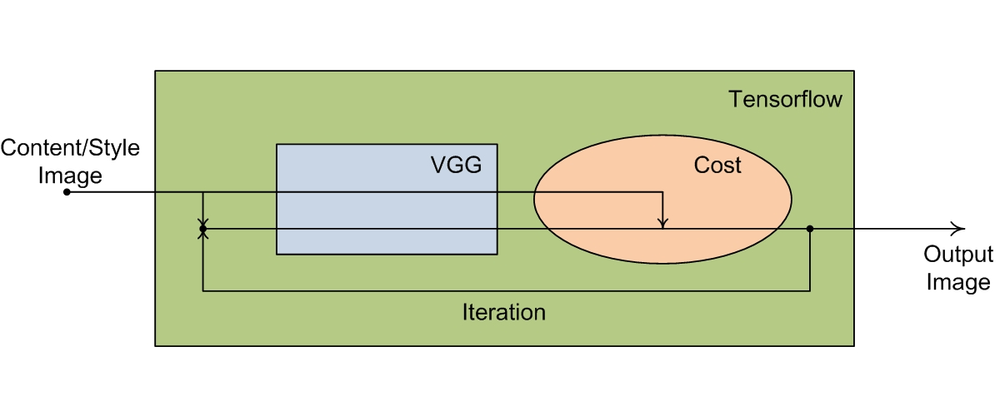
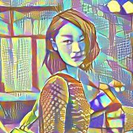
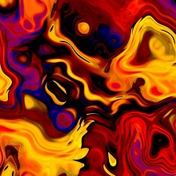
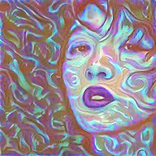

## Prisma_tensorflow
 - __Minimalism__
 - __Clean Code__
 - __Clear Structure__
 
## Dataflow

## Results
 &#8194;  &#8194; 

 &#8194;  &#8194; 

## See Also
 - [https://github.com/boyw165/tensorflow-vgg](https://github.com/boyw165/tensorflow-vgg)
 - [https://github.com/leihe001/tensorflow-vgg](https://github.com/leihe001/tensorflow-vgg)
 - [https://github.com/log0/neural-style-painting](https://github.com/log0/neural-style-painting)
 - [https://github.com/ckmarkoh/neuralart_tensorflow](https://github.com/ckmarkoh/neuralart_tensorflow)
 - [https://github.com/hzy46/fast-neural-style-tensorflow](https://github.com/hzy46/fast-neural-style-tensorflow)
