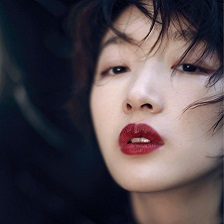

## Prisma_tensorflow
 - __Clean__ and __Clear__

## Requirements
 - _numpy.&#8194;&#8194;Image.&#8194;&#8194;tensorflow._
 - _content.jpg.&#8194;&#8194;style.jpg.&#8194;&#8194;vgg16.npy._

## Results
 &#8194;  &#8194; 

 &#8194;  &#8194; 

## See Also
 - [https://github.com/boyw165/tensorflow-vgg](https://github.com/boyw165/tensorflow-vgg)
 - [https://github.com/leihe001/tensorflow-vgg](https://github.com/leihe001/tensorflow-vgg)
 - [https://github.com/log0/neural-style-painting](https://github.com/log0/neural-style-painting)
 - [https://github.com/ckmarkoh/neuralart_tensorflow](https://github.com/ckmarkoh/neuralart_tensorflow)
